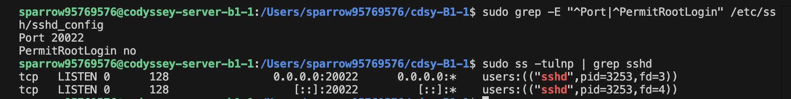
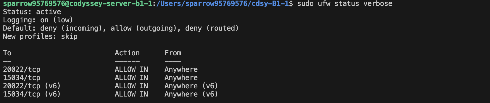
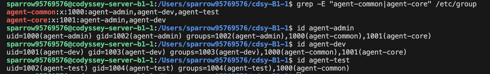
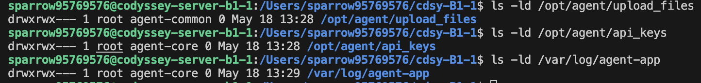
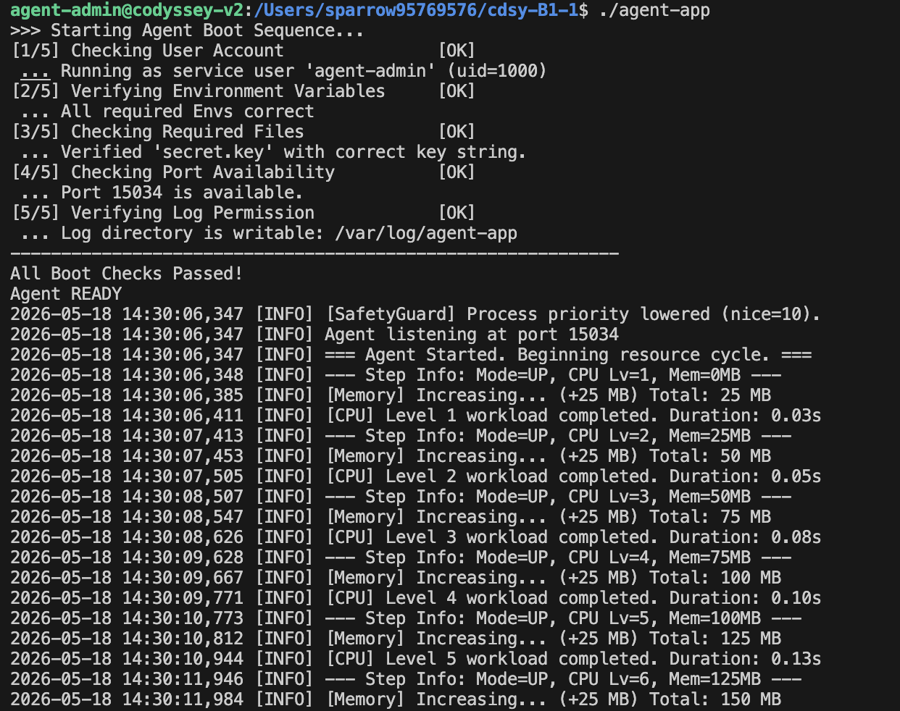
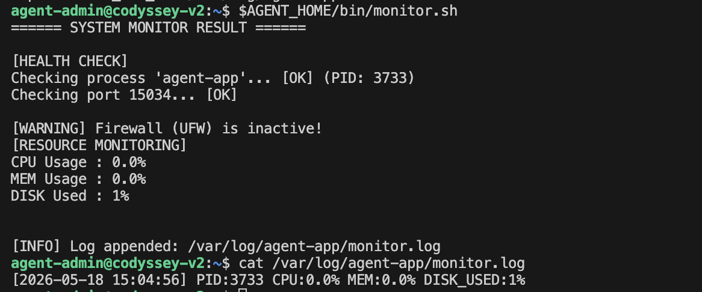
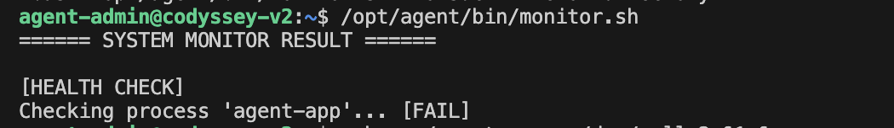
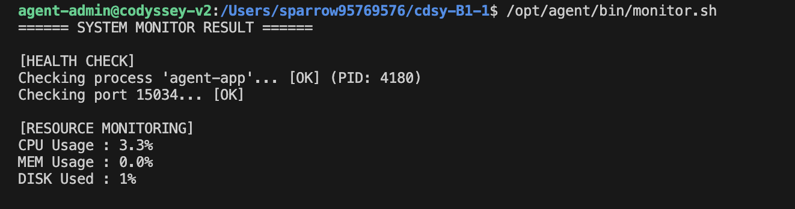
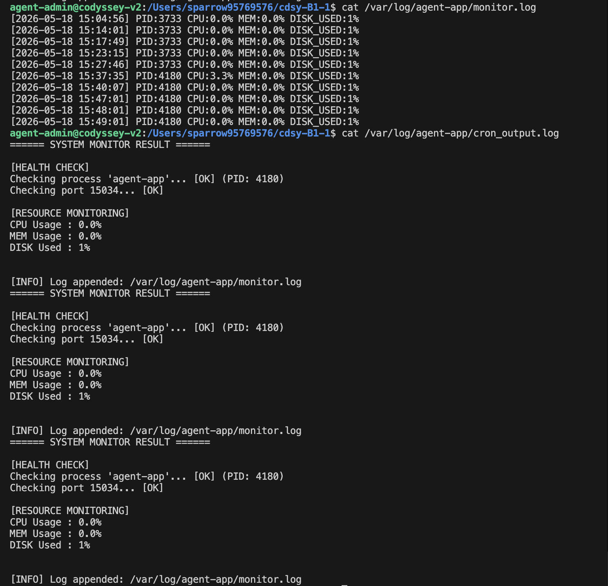

# 요구사항 수행 내역서

### [0] 실습 환경 세팅
```
// 가상머신 생성
orb create ubuntu:22.04 codyssey-server-b1-1

// 생성된 가상머신 접속
orb -m codyssey-server-b1-1

// 버전 확인
cat /etc/os-release

// 패키지 목록 업데이트 및 설치
sudo apt update
sudo apt install openssh-server -y
sudo apt install nano -y
sudo apt install ufw -y
```

<br>
<br>

### [1] 기본 보안 및 네트워크 설정
[1-1] SSH 설정
```
// 설정 파일 열기
sudo nano /etc/ssh/sshd_config

// 포트 번호 변경(편집기)
Port 20022

// 최고 관리자 로그인 차단(편집기)
PermitRootLogin no

// SSH 재시작
sudo systemctl restart ssh
```


<br>

[1-2] 방화벽 설정(UFW)
```
//포트 허용 규칙 추가
sudo ufw allow 20022/tcp
sudo ufw allow 15034/tcp

// 방화벽 활성화
sudo ufw enable

// 방화벽 설정 상세 확인
sudo ufw status verbose
```


<br>
<br>

### [2] 계정/그룹/권한 체계
[2-1] 계정, 그룹 생성
```
// 그룹 생성
sudo groupadd agent-common
sudo groupadd agent-core

// 계정 생성 및 그룹 배치(-m: 홈폴더 생성, -s: 쉘 지정, -G: 그룹 지정)
sudo useradd -m -s /bin/bash -G agent-common,agent-core agent-admin
sudo useradd -m -s /bin/bash -G agent-common,agent-core agent-dev
sudo useradd -m -s /bin/bash -G agent-common agent-test
```


<br>

[2-2] 디렉토리 구조, 접근 권한
```
// 환경 변수 설정(외부 프로그램 전용 경로)
export AGENT_HOME=/opt/agent

// 폴더 생성
sudo mkdir -p $AGENT_HOME/upload_files
sudo mkdir -p $AGENT_HOME/api_keys
sudo mkdir -p /var/log/agent-app

// 소유 그룹 지정, 권한 부여
sudo chgrp agent-common $AGENT_HOME/upload_files
sudo chmod 770 $AGENT_HOME/upload_files

sudo chgrp agent-core $AGENT_HOME/api_keys
sudo chmod 770 $AGENT_HOME/api_keys

sudo chgrp agent-core /var/log/agent-app
sudo chmod 770 /var/log/agent-app
```


<br>
<br>

### [3] 애플리케이션 실행 환경 구성

```
// 계정 변경
sudo su - agent-admin

// 환경 변수 설정
export AGENT_HOME=/opt/agent
export AGENT_PORT=15034
export AGENT_UPLOAD_DIR=$AGENT_HOME/upload_files
export AGENT_KEY_PATH=$AGENT_HOME/api_keys/t_secret.key
export AGENT_LOG_DIR=/var/log/agent-app

// 키 파일 생성
echo "agent_api_key_test" > $AGENT_KEY_PATH

// 앱 실행
./agent-app

// GLIBC 오류 발생
[PYI-3831:ERROR] Failed to load Python shared library '/tmp/_MEIKt47C7/libpython3.12.so.1.0': /lib/x86_64-linux-gnu/libm.so.6: version `GLIBC_2.38' not found (required by /tmp/_MEIKt47C7/libpython3.12.so.1.0)

// 최신 우분투로 변경 후 기존에 한 것 다시 재입력해주기
orb create ubuntu:24.04 codyssey-v2
```



<br>
<br>

### [4] 시스템 관제 자동화 스크립트 구현
[4-1] monitor.sh 구현
```
// 앱 백그라운드 실행
nohup ./agent-app > /dev/null 2>&1 &

// 스크립트 파일 생성 및 편집
sudo mkdir -p $AGENT_HOME/bin
sudo nano $AGENT_HOME/bin/monitor.sh

// 파일 위치/권한 정책
sudo chown agent-dev:agent-core $AGENT_HOME/bin/monitor.sh
sudo chmod 750 $AGENT_HOME/bin/monitor.sh

// 방화벽 상태 조회의 경우만 NOPASSWD 부여
echo "agent-admin ALL=(ALL) NOPASSWD: /usr/sbin/ufw status" | sudo tee /etc/sudoers.d/agent-admin-ufw
```


<br>

[4-2] 로그 파일 용량 관리
```
// 설정 파일 열기
sudo nano /etc/logrotate.d/agent-app

/var/log/agent-app/monitor.log {
    size 10M
    rotate 10
    missingok
    notifempty
    compress
    create 0640 agent-admin agent-core
}


// 로그 확인
cat /var/log/agent-app/monitor.log
```




<br>
<br>

### [5] 자동 실행(cron) 설정

```
// 편집기 열기
crontab -e

* * * * * /opt/agent/bin/monitor.sh >> /var/log/agent-app/cron_output.log 2>&1


// 로그 확인
cat /var/log/agent-app/cron_output.log
```
